# 2026-06-20 (六) 台灣 天氣預報
## 連江縣：

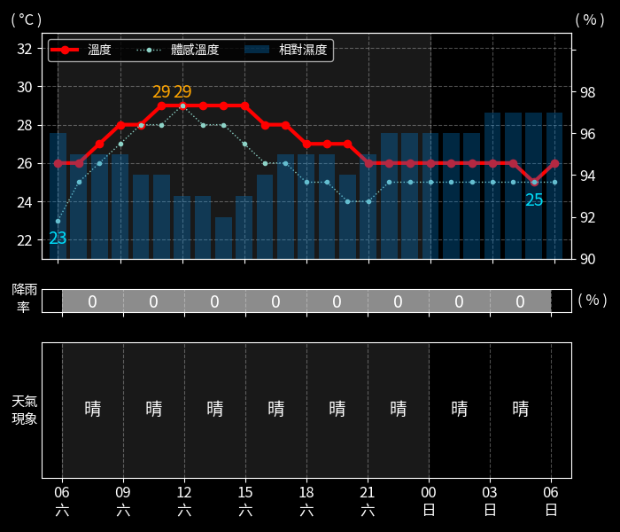

## 金門縣：

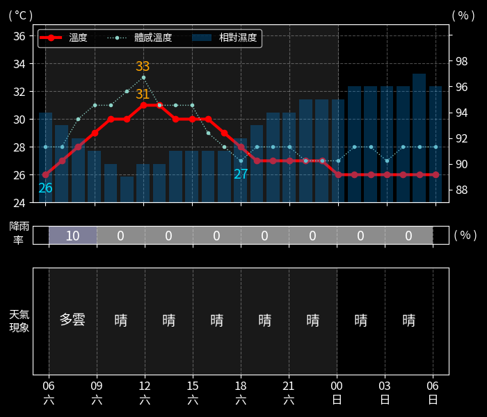

## 宜蘭縣：

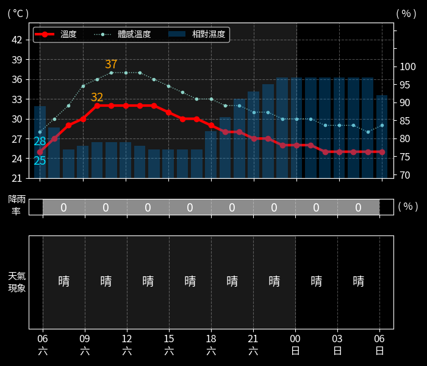

## 新竹縣：

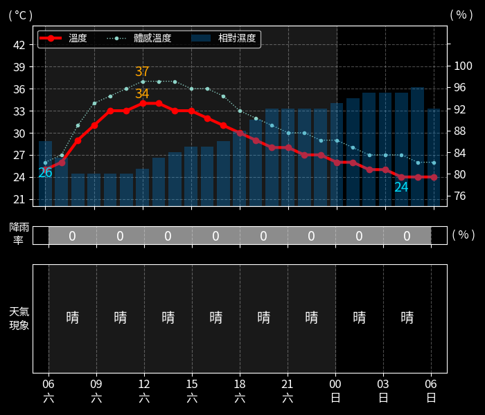

## 苗栗縣：

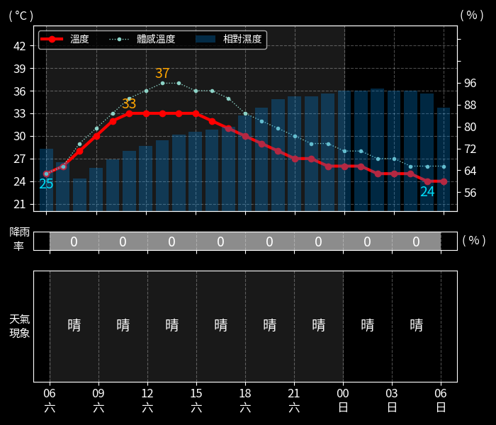

## 彰化縣：

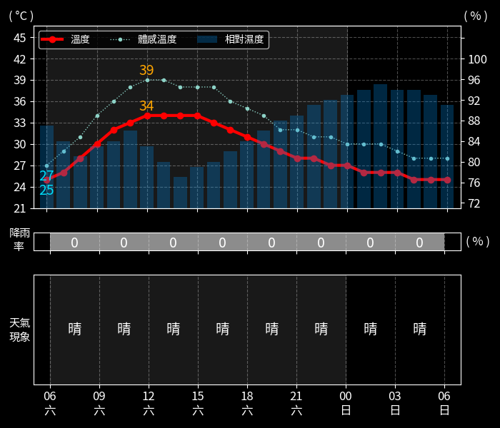

## 南投縣：

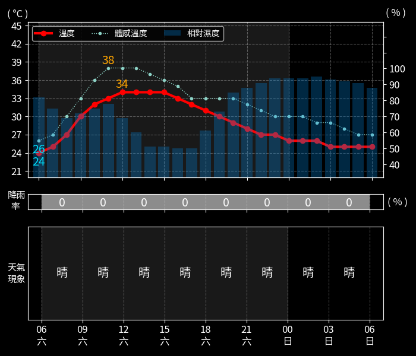

## 雲林縣：

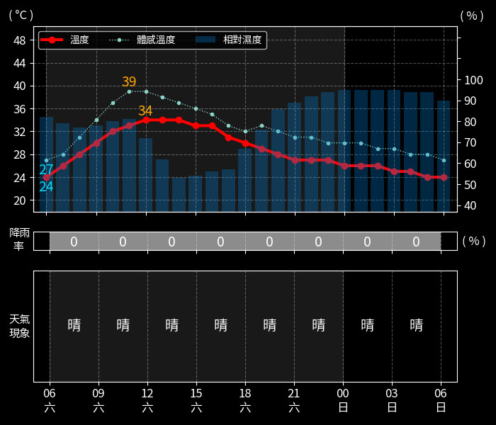

## 嘉義縣：

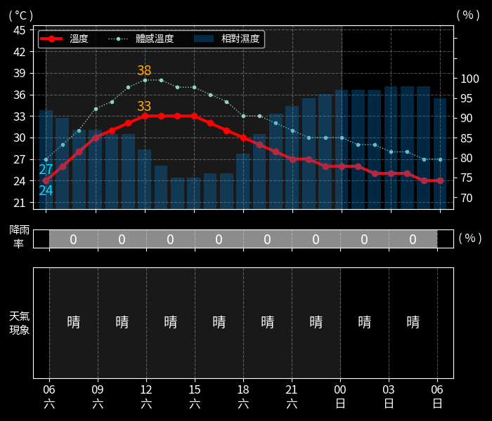

## 屏東縣：

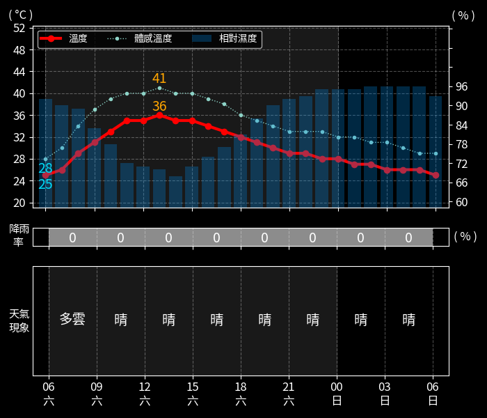

## 臺東縣：

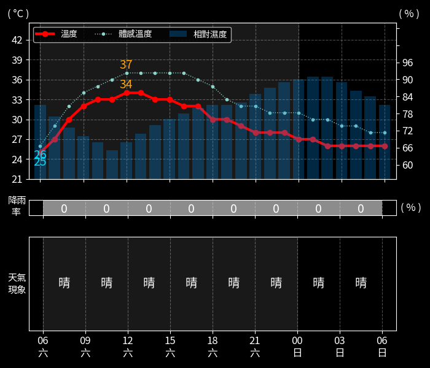

## 花蓮縣：

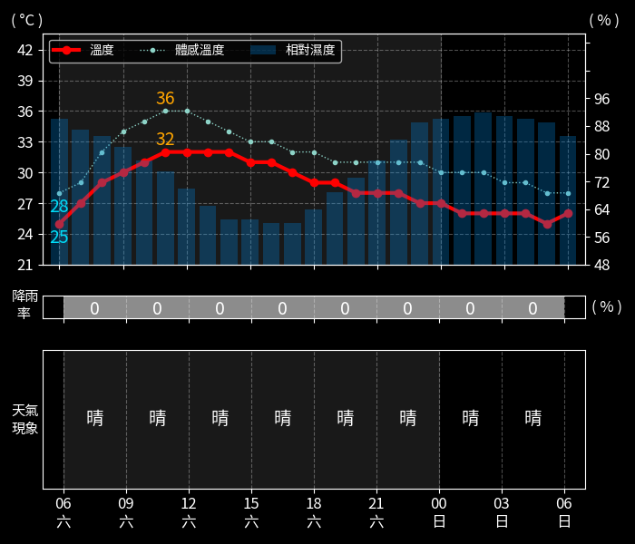

## 澎湖縣：

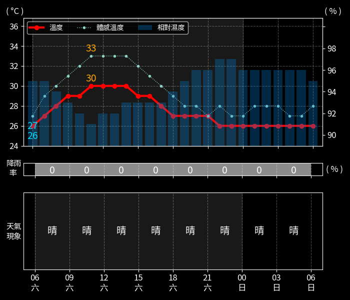

## 基隆市：

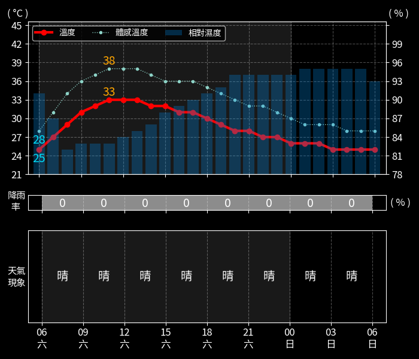

## 新竹市：

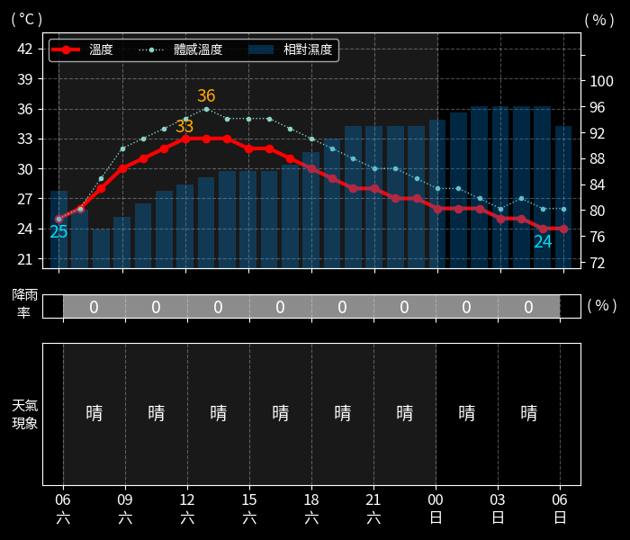

## 嘉義市：

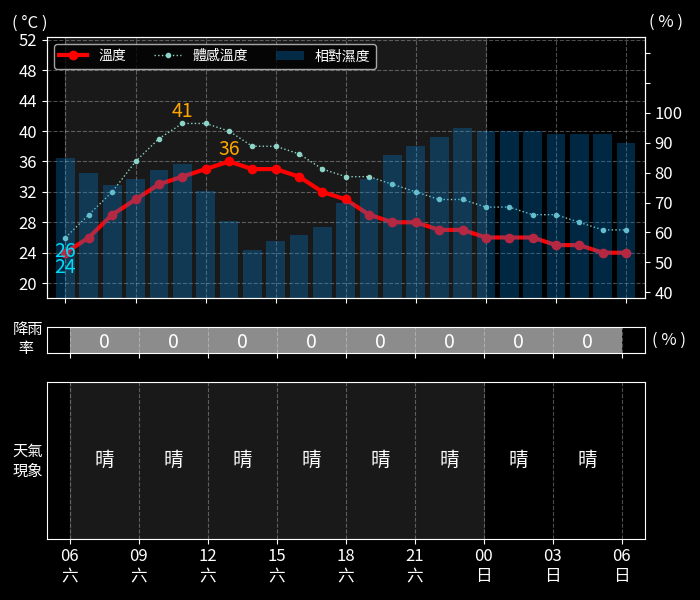

## 臺北市：

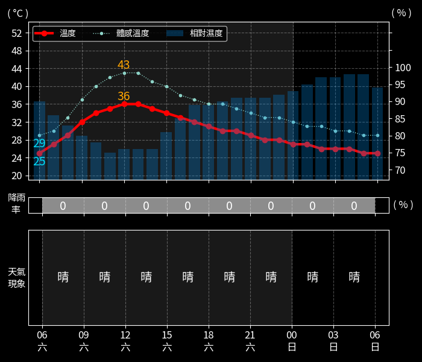

## 高雄市：

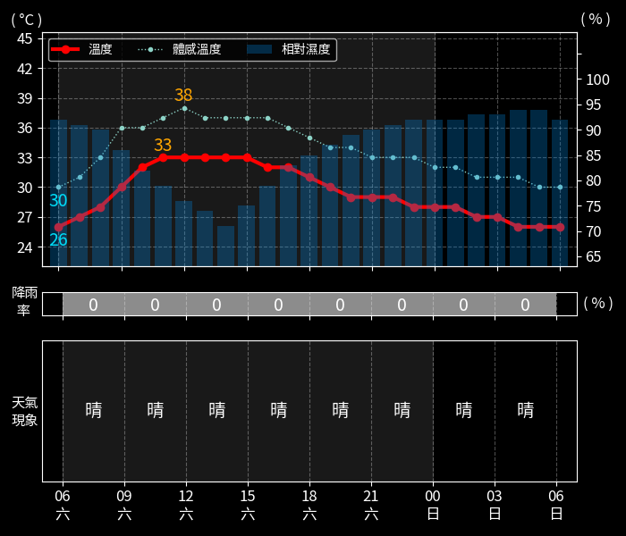

## 新北市：

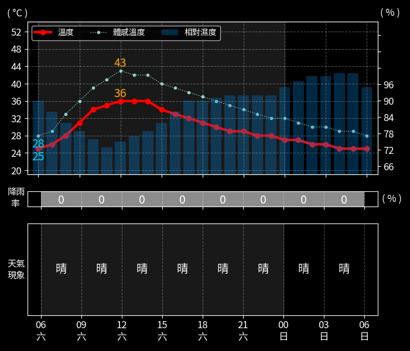

## 臺中市：

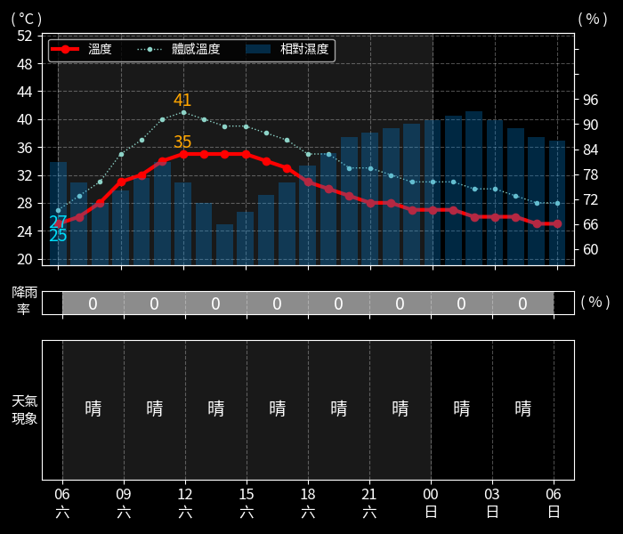

## 臺南市：

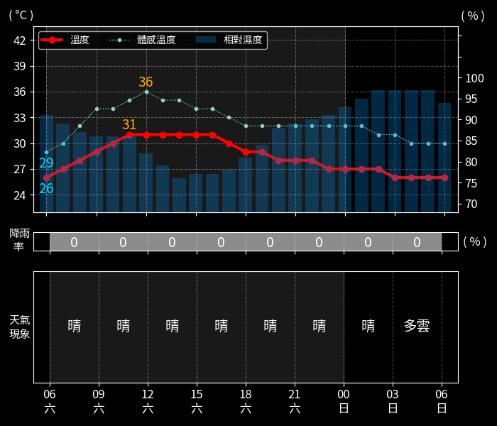

## 桃園市：

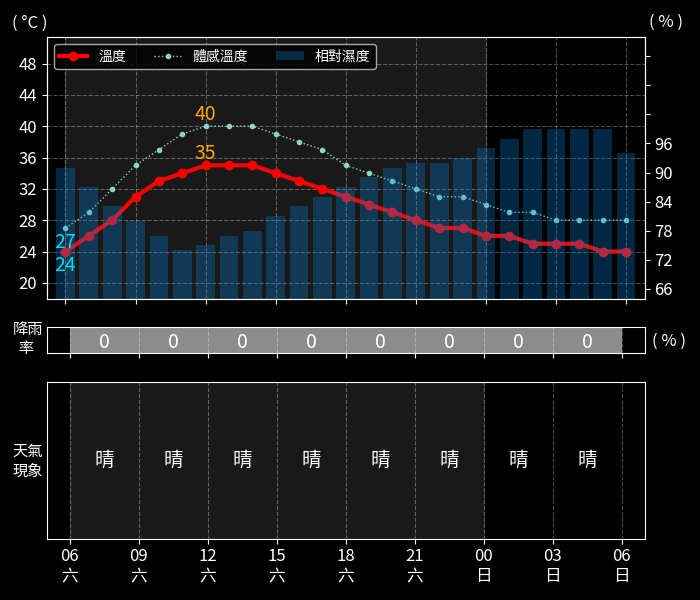

## 資料來源
中央氣象署開放資料平臺 API：https://opendata.cwa.gov.tw/dist/opendata-swagger.html#/%E9%A0%90%E5%A0%B1/get_v1_rest_datastore_F_D0047_065

 2026-06-20 05:48:16 更